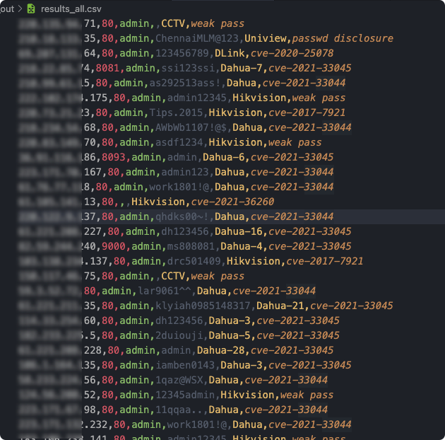
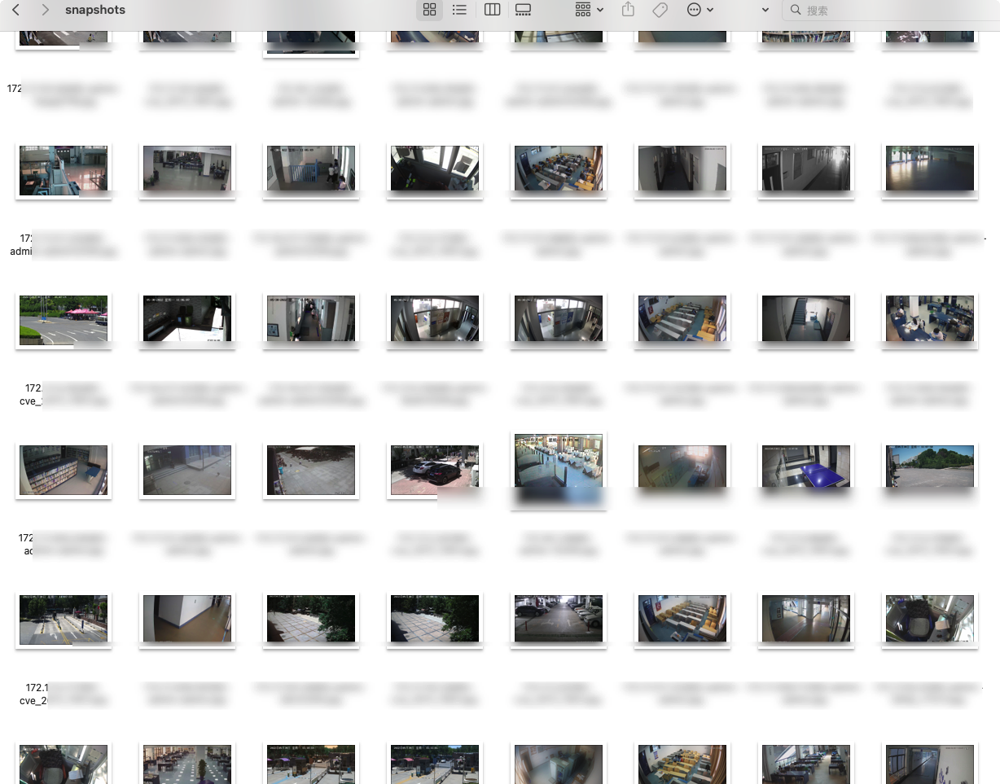
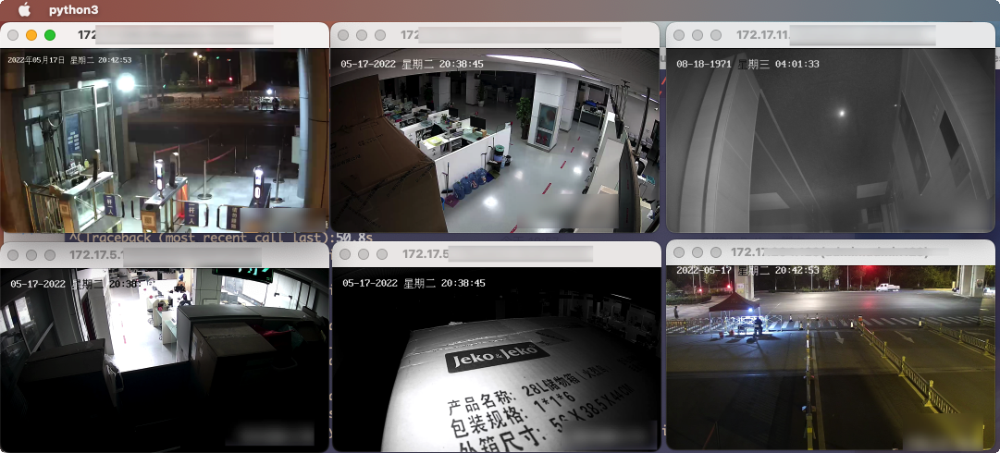

<div align=center>
    
</div>


<!-- icons -->
<div align=center>
    
    
    
    
    
    
</div>


## 简介

主要针对网络摄像头的漏洞扫描框架，目前已集成海康、大华、宇视等常见设备。后期会加入更多摄像头设备和路由器设备。


## 安装

**Windows 仍有部分bug，Linux 与 Mac可以正常使用。请确保安装了3.7及以上版本的Python，推荐3.8**

+ 克隆该仓库:
```bash
git clone https://github.com/jorhelp/Ingram.git
```

+ 进入项目目录安装依赖:
```bash
cd Ingram
pip3 install git+https://github.com/arthaud/python3-pwntools.git
pip3 install -r requirements.txt
```

至此安装完毕！


## 运行

+ 你需要准备一个目标文件，比如 target.txt，里面保存着你要扫描的 IP 地址，每行一个目标，具体格式如下：
```
# 你可以使用井号(#)来进行注释
# 单个的 IP 地址
192.168.0.1
# IP 地址以及要扫描的端口
192.168.0.2:80
# 带 '/' 的IP段
192.168.0.0/16
# 带 '-' 的IP段
192.168.0.0-192.168.255.255
```

+ 之后运行:
```bash
python run_ingram.py -i 你要扫描的文件 -o 输出文件夹
```

+ 其他参数：
```
optional arguments:
  -h, --help            打印参数信息
  -i IN_FILE, --in_file IN_FILE
                        要扫描的文件
  -o OUT_DIR, --out_dir OUT_DIR
                        扫描结果输出路径
  -p PORT [PORT ...], --port PORT [PORT ...]
                        要扫描的端口，默认为80，可以指定多个端口，比如 -p 80 81 82
  -t TH_NUM, --th_num TH_NUM
                        并发数目，默认为64，视网络状况自行调整
  -T TIME_OUT, --time_out TIME_OUT
                        超时
  --debug               调试模式
```

+ (**可选**) 扫描时间可能会很长，如果你想让程序扫描结束的时候通过微信发送一条提醒的话，你需要按照 [wxpusher](https://wxpusher.zjiecode.com/docs/) 的指示来获取你的专属 *UID* 和 *APP_TOKEN*，并将其写入 `run_ingram.py`:
```python
# wechat
config.set_val('WXUID', '这里写uid')
config.set_val('WXTOKEN', '这里写token')
```

+ 支持中断恢复，不过由于每5分钟记录一次运行状态，所以并不能准确恢复到上次的运行状态。


## 结果

```bash
.
├── not_vulnerable.csv
├── results.csv
├── snapshots
└── log.txt
```

+ `results.csv` 里保存了完整的结果, 格式为: `ip,端口,设备类型,用户名,密码,漏洞条目`:  


+ `not_vulnerable.csv` 中保存的是没有暴露的设备

+ `snapshots` 中保存了部分设备的快照:  



## 实时预览 (由于部分原因已移除)

+ ~~可以直接通过浏览器登录来预览~~
  
+ ~~如果想批量查看，我们提供了一个脚本 `show/show_rtsp/show_all.py`，不过它还有一些问题:~~



## 更新日志

+ [2022-06-11] **优化运行速度，支持存储非暴露设备，支持中断恢复**

+ [2022-07-23] **可以通过 CVE-2021-33044(Dahua) 来获取用户名与密码了！修改了摄像头快照逻辑(将rtsp替换为了http)，优化了运行速度**
    - **由于新版本加入了一些依赖包，需要重新配置环境!!!**

+ [2022-08-05] **增加了 CVE-2021-33045(Dahua NVR)，不过由于NVR设备的账号密码与真正的摄像头的账号密码可能不一致，所以快照功能并不总是有效**

+ [2022-08-06] **增加了 宇视 设备的密码暴露模块，暂不支持快照**

+ [2022-08-17] **比较大的一次更新，我们重构了所有代码 (需要重新配置环境)，具体如下：**
    - 重构了代码结构，便于以后集成更多漏洞，移除部分依赖包，减少了超参数
    - 将多线程替换为协程，速度较之前有明显提升
    - 解决了子进程无法自动关闭的bug
    - 去掉了对masscan的支持，因为新版本会自动探测端口，当然你还可以把masscan的结果ip提取出来作为Ingram的输入
    - 去掉了若干与设备相关的超参数，新版本会自动探测设备
    - 不再内置iplist，因为其太占空间且不便于维护，需要的可以自己去网上找


## 免责声明

本工具仅供安全测试，严禁用于非法用途，后果与本团队无关


## 鸣谢 & 引用

Thanks to [Aiminsun](https://github.com/Aiminsun/CVE-2021-36260) for CVE-2021-36260  
Thanks to [chrisjd20](https://github.com/chrisjd20/hikvision_CVE-2017-7921_auth_bypass_config_decryptor) for hidvision config file decryptor  
Thanks to [mcw0](https://github.com/mcw0/DahuaConsole) for DahuaConsole
