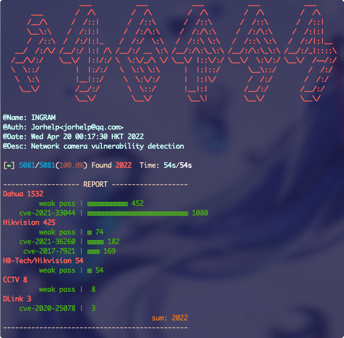

```
                   ___           ___           ___           ___           ___     
       ___        /  /\         /  /\         /  /\         /  /\         /  /\    
      /__/\      /  /::|       /  /::\       /  /::\       /  /::\       /  /::|   
      \__\:\    /  /:|:|      /  /:/\:\     /  /:/\:\     /  /:/\:\     /  /:|:|   
      /  /::\  /  /:/|:|_    /  /:/  \:\   /  /::\ \:\   /  /::\ \:\   /  /:/|:|__ 
   __/  /:/\/ /__/:/ |:| /\ /__/:/ __ \:\ /__/:/\:\_\:\ /__/:/\:\_\:\ /__/:/_|::::\
  /__/\/:/    \__\/  |:|/:/ \  \:\/_/\ \/ \__\/ |::\/:/ \__\/  \:\/:/ \__\/  /~~/:/
  \  \::/         |  |:/:/   \  \:\ \:\      |  |:|::/       \__\::/        /  /:/ 
   \  \:\         |__|::/     \  \:\/:/      |  |:|\/        /  /:/        /  /:/  
    \__\/         /__/:/       \  \::/       |__|:|         /__/:/        /__/:/   
                  \__\/         \__\/         \__\|         \__\/         \__\/    
```

```
@Name: INGRAM
@Auth: Jorhelp<jorhelp@qq.com>
@Date: Wed Apr 20 00:17:30 HKT 2022
@Desc: Network camera vulnerability detection
```


## 简介

学校、医院、商场、餐厅等等这些设备维护不太完善的地方，总会存在各种漏洞，要么是不及时打补丁，要么是图省事使用弱口令
本工具可以使用多线程批量检测局域网或公网上的摄像头是否存在漏洞，以便于及时修复，提高设备安全性


## 开始扫描

克隆本项目，并安装依赖：
```shell
git clone git@github.com:jorhelp/Ingram.git
cd Ingram
pip install -r requirements.txt
```

需要自行创建一个IP文件，每行一个条目，可以是单个ip，或IP段，下面的写法都是合法的：
```shell
192.168.66.66
10.0.0.0/8
172.16.0.0-172.31.255.255
```

当然，也可以直接使用statics目录下的IP文件，比如`statics/iplist/data/country/JP.txt`

使用 `--all` 参数扫描所有漏洞，线程数量 `--th_num` 根据网络情况自行调整：
```shell
./run_Ingram.py --in_file statics/iplist/data/country/JP.txt --out_file results --all --th_num 80
```

或者指定只扫描某个漏洞:
```shell
./run_Ingram.py --in_file statics/iplist/data/country/JP.txt --out_file results --cve_2017_7921 --th_num 80
```

运行截图：


结果展示（需要注意，cve-2021-36260漏洞无法提供用户名与密码，cve-2017-7921的用户名与密码在后面的一大串字符串中，需要自行查找）：


### (可选)借助 masscan 进行提速

如果对所有ip进行扫描是非常耗时的，我们可以使用端口扫描工具先找到端口开房的主机，然后对这部分主机进行漏洞扫描，masscan工具需要自行安装
```shell
./run_Ingram.py --in_file statics/iplist/data/country/JP.txt --out_file port80 --masscan --port 80 --rate 5000
./run_Ingram.py --in_file port80 --out_file results --all --th_num 80
```


### (可选)微信提醒

需要去 [wxpusher](https://wxpusher.zjiecode.com/docs/) 注册并创建应用，获得自己微信的UID，以及应用的APP_TOKEN，然后将这两个东西写入到 `utils/wechat.py` 里面uids以及token中，下面的xxxx部分:
```python
def send_msg(content: str = "default content") -> Dict:
    return WxPusher.send_message(uids=['xxxxxxxxxxxxxxxxxxxxxxxxxxxxxxxx'],
                                 token='xxxxxxxxxxxxxxxxxxxxxxxxxxxxxxxx',
                                 content=f'{content}')
```

之后，运行工具时，加上参数 `--send_msg` 即可在微信上查收提醒:
```shell
./run_Ingram.py --in_file statics/iplist/data/country/JP.txt --out_file results --all --th_num 80 --send_msg
```


## 查看摄像头画面

需要将存在漏洞的摄像头按照以下格式保存在文件中：
```shell
192.168.0.1,user,passwd
192.168.0.2,cve-2017-7921
```

是的，建议使用 `ip,用户名,密码` 的格式，如果设备存在 cve-2017-7921 漏洞的话，也可以使用 `ip,cve-2017-7921` 格式，但是不建议这样做，因为这种方式展示的是一组图片，而不是视频，所以会明显卡顿

运行：
```shell
python3 -Bu show/show_rtsp/show_all.py cameras_file
```

运行截图：


## 免责声明

本工具仅供学习与安全检测，请勿用于非法用途，一切因本工具导致的法律后果均由使用者自己承担!!!


## Acknowledgements & References

Thanks to [Aiminsun](https://github.com/Aiminsun/CVE-2021-36260) for CVE-2021-36260
Thanks to [chrisjd20](https://github.com/chrisjd20/hikvision_CVE-2017-7921_auth_bypass_config_decryptor) for hidvision config file decryptor
Thanks to [metowolf](https://github.com/metowolf/iplist) for ip list
