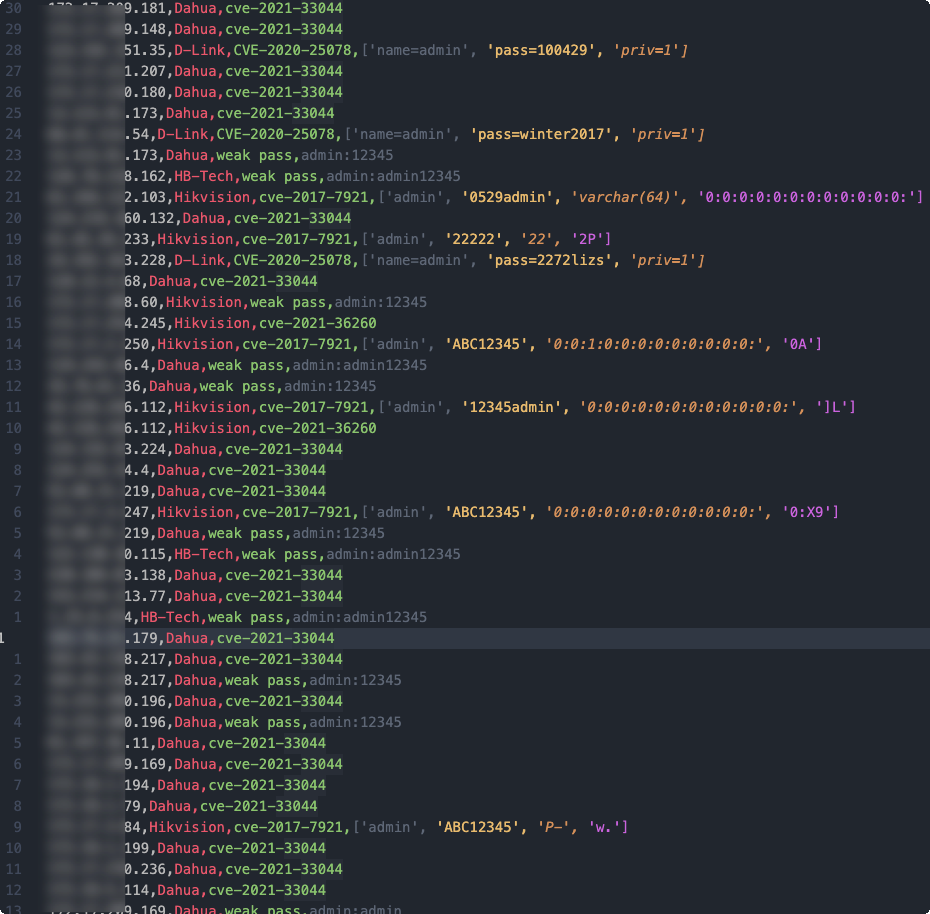
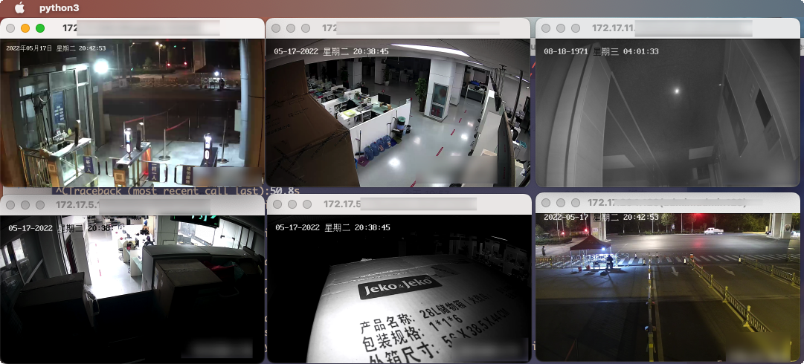

```
                   ___           ___           ___           ___           ___     
       ___        /  /\         /  /\         /  /\         /  /\         /  /\    
      /__/\      /  /::|       /  /::\       /  /::\       /  /::\       /  /::|   
      \__\:\    /  /:|:|      /  /:/\:\     /  /:/\:\     /  /:/\:\     /  /:|:|   
      /  /::\  /  /:/|:|_    /  /:/  \:\   /  /::\ \:\   /  /::\ \:\   /  /:/|:|__ 
   __/  /:/\/ /__/:/ |:| /\ /__/:/ __ \:\ /__/:/\:\_\:\ /__/:/\:\_\:\ /__/:/_|::::\
  /__/\/:/    \__\/  |:|/:/ \  \:\/_/\ \/ \__\/ |::\/:/ \__\/  \:\/:/ \__\/  /~~/:/
  \  \::/         |  |:/:/   \  \:\ \:\      |  |:|::/       \__\::/        /  /:/ 
   \  \:\         |__|::/     \  \:\/:/      |  |:|\/        /  /:/        /  /:/  
    \__\/         /__/:/       \  \::/       |__|:|         /__/:/        /__/:/   
                  \__\/         \__\/         \__\|         \__\/         \__\/    
```


<div align=center>
    
</div>


<!-- icons -->
<div align=center>
    
    
    
    
</div>


简体中文 | [English](https://github.com/jorhelp/Ingram/blob/master/README.md)


## 简介


一个多线程批量检测网络摄像头是否暴露的工具。

**只在 Mac 与 Linux 上测试过，没有在 Windows 平台进行测试**


## 安装

+ 克隆该仓库:
```bash
git clone https://github.com/jorhelp/Ingram.git
```

+ 确保你安装了 3.7 及以上的 Python，然后进入项目目录安装依赖:
```bash
cd Ingram
pip install -r requirements.txt
```

至此安装完毕！


## 运行之前的准备工作

+ 你需要准备一个目标文件，里面保存着你要扫描的 IP 地址，每行一个目标，具体格式如下：
```
# 你可以使用井号(#)来进行注释
# 单个的 IP 地址
192.168.0.1
# IP 地址以及要扫描的端口
192.168.0.2:80
# 带 '/' 的IP段
192.168.0.0/16
# 带 '-' 的IP段
192.168.0.0-192.168.255.255
```

+ `utils/config.py` 文件里已经指定了一些用户名与密码来支持弱口令扫描，你可以随意修改它们（如果你想测试其他密码的话）:
```python
# camera
USERS = ['admin']
PASSWORDS = ['admin', 'admin12345', 'asdf1234', '12345admin', '12345abc']
```

+ (**可选**) 扫描时间可能会很长，如果你想让程序扫描结束的时候通过微信发送一条提醒的话，你需要按照 [wxpusher](https://wxpusher.zjiecode.com/docs/) 的指示来获取你的专属 *UID* 和 *APP_TOKEN*，并将其写入 `utils/config.py`:
```python
# wechat
UIDS = ['This is your UID', 'This is another UID if you have', ...]
TOKEN = 'This is your APP_TOKEN'
```

+ (**可选**) 邮件提醒暂时不支持...


## 运行

```shell
optional arguments:
  -h, --help           show this help message and exit
  --in_file IN_FILE    the targets will be scan
  --out_path OUT_PATH  the path where results saved
  --send_msg           send finished msg to you (by wechat or email)
  --all                scan all the modules of [hik_weak, dahua_weak, cve_...]
  --hik_weak
  --dahua_weak
  --cctv_weak
  --hb_weak
  --cve_2021_36260
  --cve_2021_33044
  --cve_2017_7921
  --cve_2020_25078
  --th_num TH_NUM      the processes num
  --nosnap             do not capture snapshot
  --masscan            run massscan sanner
  --port PORT          same as masscan port
  --rate RATE          same as masscan rate
```

+ 使用所有模块来扫描 (**TARGET** 是你的目标文件, **OUT_DIR** 是结果保存路径):
```bash
# th_num 线程数量根据你的网络情况自行调整
./run_ingram.py --in TARGET --out OUT_DIR --all --th_num 80

# 如果你已经配置好了微信，那么 --send_msg 参数应该加上
./run_ingram.py --in TARGET --out OUT_DIR --all --th_num 80 --send_msg
```

+ 摄像头快照 (默认是支持快照抓取的，如果你嫌它太慢可以使用 --nosnap 参数来关闭)
```bash
./run_ingram.py --in TARGET --out OUT_DIR --all --th_num 80 --nosnap
```

+ 在 `statics/iplist/data/` 路径下有一些 IP 文件，你可以直接拿来使用，例如扫描日本（JP）的设备：
```shell
./run_ingram.py --in statics/iplist/data/country/JP.txt --out OUT_DIR --all --th_num 80
```

+ 所有的模块可以任意组合，例如，如果你想扫描海康设备，那么:
```shell
./run_ingram.py --in TARGET --out OUT_DIR --hik_weak --cve_2017_7921 --cve_2021_36260 --th_num 80
```

+ 可以使用 Masscan 来加速扫描过程，原理就是先用 Masscan 找到指定端口开放的设备，然后再扫描这些设备 (Masscan需要自己安装):
```shell
./run_ingram.py --in TARGET --out OUT_DIR --masscan --port 80,8000-8008 --rate 5000
./run_ingram.py --in OUT_DIR/masscan_res --out OUT_DIR --all --th_num 80
```

+ 中断恢复。如果因为网络原因或其他原因导致运行中断了，只需运行和之前相同的命令即可继续运行，例如，如果你之前执行的是 `./run_ingram.py --in ip.txt --out output --all --th_num 80`，只需继续执行该命令即可恢复。对于 Masscan 也是一样。


## 结果

```bash
.
├── not_vulnerable.csv
├── results_all.csv
├── results_simple.csv
└── snapshots
```

+ `OUT_DIR/results_all.csv` 文件里面保存了完整的结果, 格式为: `ip,port,user,passwd,device,vulnerability`:  


+ `OUT_DIR/results_simple.csv` 文件里面只保存了有密码的目标，格式为: `ip,port,user,passwd`

+ `OUT_DIR/not_vulnerable.csv` 中保存的是没有暴露的设备

+ `OUT_DIR/snapshots/` 中保存了部分设备的截图:  


## 实时预览

+ 可以直接通过浏览器登录来预览
  
+ 如果想批量查看，我们提供了一个脚本 `show/show_rtsp/show_all.py`，不过它还有一些问题:
```shell
python3 -Bu show/show_rtsp/show_all.py OUT_DIR/results_all.csv
```




## 更新日志

+ [2022-06-11] **优化运行速度，支持存储非暴露设备**

+ [2022-06-11] **支持中断恢复**


## 免责声明

本工具仅供安全测试，严禁用于非法用途，后果与本团队无关


## 鸣谢 & 引用

Thanks to [Aiminsun](https://github.com/Aiminsun/CVE-2021-36260) for CVE-2021-36260  
Thanks to [chrisjd20](https://github.com/chrisjd20/hikvision_CVE-2017-7921_auth_bypass_config_decryptor) for hidvision config file decryptor  
Thanks to [metowolf](https://github.com/metowolf/iplist) for ip list  
